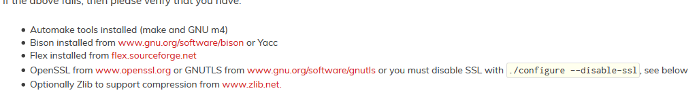

[TOC]

---
### 链接
[gSoap官网](http://www.cs.fsu.edu/~engelen/soap.html)

### 环境搭建

- automake
[手动安装m4, autoconf, automake, libtool](http://blog.csdn.net/qq_30549833/article/details/72955881)

- zlib
http://www.zlib.net/zlib-1.2.11.tar.gz

- openssl
https://www.openssl.org/source/openssl-1.0.2n.tar.gz

- bison
http://ftp.gnu.org/gnu/bison/bison-3.0.tar.gz

- flex
http://flex.sourceforge.net/

### 预安装
yacc         apt-get install byacc
flex         apt-get install flex  (重新运行./configure)
-ly          apt-get install bison
-lssl        apt-get install libssl-dev

### 编译和安装gsoap
./configure --enable-sample --enable-ipv6 --enable-debug --with-openssl=DIR --with-zlib=DIR

