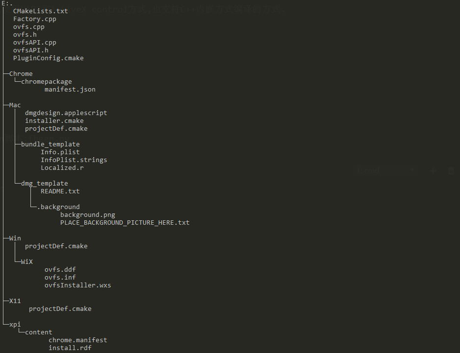

[TOC]

---
## FireBreath简介
    FireBreath是易于扩展的一个强有力的浏览器插件的框架.
    它的目的是成为一个跨平台的插件架构.
    使用FireBreath方式编译出来的插件可以使用NAPI和ActiveX control方式,也支持C++内嵌方式编译的方式.
---
## 历史版本
    目前有两个分支版本
    1.x 目前只会修改bug
    2.0 正在开发和扩展中

---
## 入门教程
### a. 创建新工程
    FireBreath中有一个创建新工程的python脚本:fbgen.py.
- 目录的结构为

### b. 编译FireBreath插件

### c. 安装
- windows regsvr32 testPlugin.dll
- Linux 把生成的动态库拷贝到$HOME/.mozilla/plugins/.

### d.测试

## 相关资料
[firebreath在vs2013上的应用](https://www.cnblogs.com/foohack/p/6598700.html)

## FireBreath的框架结构
