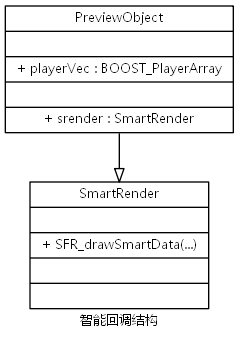

# 1.1 结构分析

## 结构分析
```cpp
// PreviewObject.h
typedef boost::array<PlayerFramePtr,ANTS_MAX_CHANNUM_EX> BOOST_PlayerArray;

class PreviewObject:...
{
    ...
    BOOST_PlayerArray playerVec; // 解码器组
    int currentFocusWnd;   // 焦点通道idx
    ...
    SmartRender srender;
    ...
}

// smartFrameRender.h
class SmartRender
{
    ...
    void SFR_drawSmartData(HDC hDC, unsigned int iVideoWidth, unsigned int iVideoHeigth, unsigned int iWindowWidth, unsigned int iWindowHeight);
    ...
}
```

## API参数分析
```cpp
/*
 参数：
 @nPort 解码器标识符
 @hDC
 @width,height 视频的宽高
 @nUser 用户定义数据
 */
static long __stdcall Draw_smart_fun_cb(long nPort,HDC hDC,unsigned int width , unsigned int height ,LONG nUser);
```

