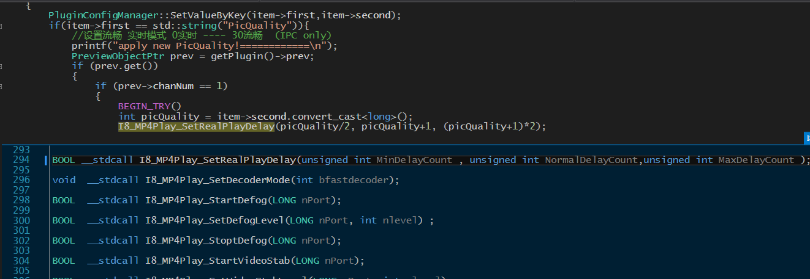

# 2.2 流程分析

## 2.2.1 插件的处理流程
### NPAntsTestAPI类的构造函数中注册获取注册表的方法
// 获取注册表配置
```cpp
registerMethod("GetRegConfig",
    make_method(this, &NPAntsTestAPI::GetRegConfig));

FB::variant NPAntsTestAPI::GetRegConfig(std::string key)
{
	return PluginConfigManager::QueryValueByKey(key);
}

RegeditWrapper  PluginConfigManager::regConf;

// 获取逻辑，获取成功返回 获取失败设置默认值返回.
regConf::GetRegValue("PicQuality");
```
// 设置注册表配置
```cpp
registerMethod("SetRegConfig",
    make_method(this, &NPAntsTestAPI::SetRegConfig));

long NPAntsTestAPI::SetRegConfig(FB::JSObjectPtr obj)
{
...
    if (item->first == std::string("PicQuality")) {
        //设置流畅 实时模式 0实时 ---- 30流畅
        PreviewObjectPtr prev = getPlugin()->prev;
        if (prev.get())
        {
            if (prev->chanNum == 1)
            {
                BEGIN_TRY()
                int picQuality = item->second.convert_cast<long>();
                I8_MP4Play_SetRealPlayDelay(picQuality/2, picQuality+1, (picQuality+1)*2);
                END_CATCH()
            }
        }
    }
...
}
```
