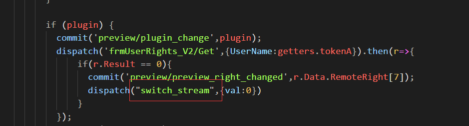
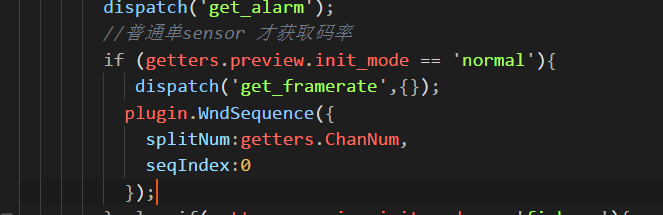

# 3.2 流程分析

## 3.2.1 Vue中预览插件调用

```cpp
  switch_stream({commit,state,getters,dispatch},{val}) {//预览切换码流
 
     let Activex;
      if (!getters.preview_right) return;
      if (Activex = getters.preview_plugin) {

        if (getters.plugin_type == 'flash') {

           msg([getters.ip,getters.rtmp_port])
            let rtmp_url = ['rtmp://', getters.ip, ':', getters.rtmp_port, '/live'].join('');
             if(getters.factory_info.IsOfFishEye == 'y'){

                 let chList = rangeArray(1,getters.ChanNum);
                 chList = chList.map(item=>{
                    return {
                      ch:item,
                      stream_type:0
                    }
                 })
                Activex.OpenDeviceAll(rtmp_url,JSON.stringify(chList));
             }
             else{
                if (val == "0") {

                 // Activex.StopStream(1, rtmp_url, 'ch01_sub.264');

                  Activex.PlayStream(1, rtmp_url, 'ch01.264');
                }
                else if (val == "1") {

                  //Activex.StopStream(0, rtmp_url, 'ch01.264');

                  Activex.PlayStream(1, rtmp_url, 'ch01_sub.264');
                }else if(val == "3"){//三码流
                  Activex.PlayStream(1, rtmp_url, 'ch01_third.264');
                }
                //Activex.PlaySmart(is_play_rule,is_play_result);
             }
            
        } 
        else {

            dispatch('preview_plugin_callbackmsg',{});
            if (getters.preview.init_mode == 'fisheye') {
              let chList = rangeArray(1,getters.ChanNum);
              Activex.OpenAllStream({
                "streamType": val,
                "transProto": 1,
                "chList": chList,
                "ip": getters.ip,
                "port": getters.rtsp_port,
                "usrname": getters.tokenA,
                "pwd": getters.tokenB,
              });
            }
            else if (getters.preview.init_mode == 'normal') {
              Activex.StopStream({"ch": 1});
              msg(["playstream",getters.ip,getters.rtsp_port,getters.tokenA,getters.tokenB,val])
              Activex.PlayStream({
                "streamType": val,
                "transProto": 1,
                "ch": 1,
                "ip": getters.ip,
                "port": getters.rtsp_port,
                "usrname": getters.tokenA,
                "pwd": getters.tokenB
              });
            }

          var color = Activex.GetColor({ch:1});
          //开流之后
          setTimeout(_=>{
            commit('preview/plugin_color_changed',color)
          },250);

          Activex.EnableSmartDisplay({"type":0,"param":0x1});
          Activex.EnableSmartDisplay({"type":0,"param":0x2});
        }
      }
  },
```


## 3.2.2 插件中的API
// 流的播放
```cpp

```
// 窗口的划分
```cpp
registerMethod("WndSequence",
    make_method(this, &NPAntsTestAPI::WndSequence));

long NPAntsTestAPI::WndSequence(FB::JSObjectPtr obj)
{
...
    prev->WndSequence(splitNum, seqIndex, 1);
...
}

// 固定窗口
//@curSplitNum
//@seqIndex
//@mode
long PreviewObject::WndSequence(long curSplitNum,long seqIndex,long mode)
{

}

//
```

