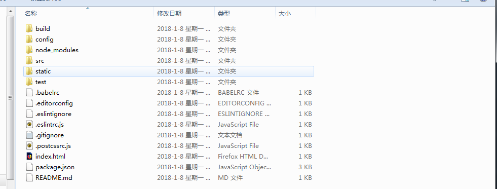
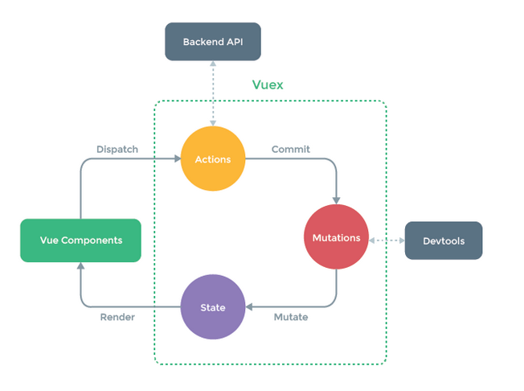
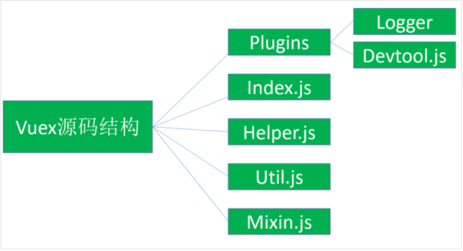
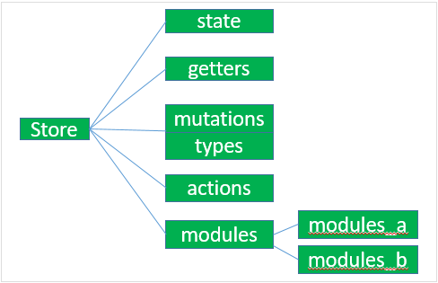

[TOC]

---
## 常用链接

[Vue的API](https://cn.vuejs.org/v2/api/)
[Vue的编程风格](https://cn.vuejs.org/v2/style-guide/#%E7%BB%84%E4%BB%B6-%E5%AE%9E%E4%BE%8B%E7%9A%84%E9%80%89%E9%A1%B9%E7%9A%84%E9%A1%BA%E5%BA%8F-%E6%8E%A8%E8%8D%90)
[Vue样例](https://cn.vuejs.org/v2/examples/index.html)

## 专业术语

|名称|解释|
:---: | :---:
 MVVM模型(Model-View-ViewModel) | 基于MVP框架把WPF的新特性糅合进去.软件UI层更加细节化和可定制.

[MVC,MVP,MVVM模型](http://www.ruanyifeng.com/blog/2015/02/mvcmvp_mvvm.html)

## Vue工程框架

可以使用Bootstrap作为后台框架,使用Vue模板去渲染.
1.build和config文件主要是webpack打包和端口的信息配置
2.dist是打包后会生成的文件
3.node_module是webpack的依赖模块
4.static主要存放静态资源
5.src主要存放的是当前的项目文件,一般由components和module两部分组成

## Vue文件结构
### 样式表
    

### 模板
    <template>
        // TODO
    </template>

### JS逻辑处理  
    

## Vue的生命周期
    开始创建->初始化数据->编译模板->挂载Dom->(渲染->更新->渲染)->卸载.

## Vue基本组件
    new Vue({
        el,    //要绑定的DOM element
        data,  //要绑定的资料
        props, //可用来接收父原件资料的属性
        template, //要解析的模块,可以是#id, HTTP或某个DOM element实体
        computed, //定义资料的getter和setter,即需要计算后才能使用的值
        components, //定义子元件,可用ES6简写法 例如(MyHeader)
        methods,   //定义可以在元件或样版类使用的方法
        propsData,  //存放预设的props内容,方便测试使用
        relplace,   //要不要用template取代el指向DOM Element预设为true
    })

## v-if和v-show的差别
    最大差别在于对DOM的操作.
    v-if会依照条件决定是否将原件渲染至网页上,并决定时间于材料的监听是否要绑定至原件或直接销毁该原件.
    v-show必定会产生原件,但以条件来切换css的实现与否,若条件改变频繁,用v-show切换更合适.

## Vue的入门Demon
[GIT_SOURCE(基于Vue1.0)](https://github.com/keepfool/vue-tutorials)

## Vue.js模板语法整理
### 1.插值
#### 1.1 文本
    

     
{{ message }}

    

#### 1.2 Html(v-html指令)
    

     

    

    

#### 1.3 属性(v-bind指令)
    

        <label for="r1">修改颜色</label><input type="checkbox" v-model="class1" id="r1">
          
        

            directiva v-bind:class
        

    

    

#### 1.4 表达式

    

        {{5+5}} 
        {{ ok ? 'YES' : 'NO' }} 
        {{ message.split('').reverse().join('') }}
        
菜鸟教程

    

        
    

### 2.指令
指令是带有v-前缀的特殊属性
指令用于在表达式的值发生改变时,将某些行为应用到DOM上.

#### 2.1 参数
    v-if v-bind v-on

#### 2.2 修饰符
    修饰符是以半角句号.指明的特殊后缀,用于指出一个指定应该以特殊方式绑定.
    .prevent修饰符告诉v-on指令对于触发的事件调用event.preventDefault()

### 3.用户输入
    input输入框中用v-model指令来实现双向数据绑定.
    

        
{{ message }}

        <input v-model="message">
    

        
    

    字符串反转
    

        
{{ message }}

        <button v-on:click="reverseMessage">反转字符串</button>
    

        
    

### 4.0 过滤器
    vue.js允许自定义过滤器,用于常见文本的格式化.由管道符表示.
    <!-- 在两个大括号中 -->
    {{ message | capitalize }}

    <!-- 在 v-bind 指令中 -->
    

    第一个字符改为大写
    

      {{ message | capitalize }}
    

        
    

### 5.0 缩写
    <!-- 完整语法 -->
    
    <!-- 缩写 -->
    

    <!-- 完整语法 -->
    
    <!-- 缩写 -->
    

### 6.0 Vue实例
#### 6.1 构造器
    var vm = new Vue({
          // 选项
        })

#### 6.2 代理data对象里面的所有属性
    每个Vue实例都会代理其data对象里面的所有属性
    var data = { a: 1 }
    var vm = new Vue({
      data: data
    })
    vm.a === data.a // -> true
    // 设置属性也会影响到原始数据
    vm.a = 2
    data.a // -> 2
    // ... 反之亦然
    data.a = 3
    vm.a // -> 3

#### 6.3 属性和方法
    var data = { a: 1 }
    var vm = new Vue({
      el: '#example',
      data: data
    })
    vm.$data === data // -> true
    vm.$el === document.getElementById('example') // -> true
    // $watch 是一个实例方法
    vm.$watch('a', function (newVal, oldVal) {
      // 这个回调将在 `vm.a`  改变后调用
    })

## 条件语句
### a. v-if, v-else, v-else-if
    

        

          A
        

        

          B
        

        

          C
        

        

          Not A/B/C
        

    

        
    

### b. v-show
    <h1 v-show="ok">Hello!</h1>

## 循环语句
### a. v-for指令
    (参数, 键值，序号)
    

      <ol>
        <li v-for="site in sites">
          {{ site.name }}
        </li>
      </ol>
    

     
    

## 计算属性
### 计算属性关键词:computed.
    

      
原始字符串: {{ message }}

      
计算后反转字符串: {{ reversedMessage }}

    

     
    

    var vm = new Vue({
      el: '#app',
      data: {
        name: 'Google',
        url: 'http://www.google.com'
      },
      computed: {
        site: {
          // getter
          get: function () {
            return this.name + ' ' + this.url
          },
          // setter
          set: function (newValue) {
            var names = newValue.split(' ')
            this.name = names[0]
            this.url = names[names.length - 1]
          }
        }
      }
    })
    // 调用 setter， vm.name 和 vm.url 也会被对应更新
    vm.site = '菜鸟教程 http://www.runoob.com';
    document.write('name: ' + vm.name);
    document.write(' ');
    document.write('url: ' + vm.url);

## 样式绑定
    class和style是HTML元素的属性,用于设置元素的样式.可以用v-bind设置样式.
### a.class属性
### b.style内嵌样式

## 事件处理器
### a.事件修饰符
    .stop   // 阻止单击事件冒泡
    .prevent  //
    .capture  // 添加事件监听器时使用事件捕获模式
    .self     // 事件在该元素本身
    .once     // 事件只能点击一次

### b.按键修饰符
    .enter
    .tab
    .delete
    .esc
    .space
    .up
    .down
    .left
    .right
    .ctrl
    .alt
    .shift
    .meta

## 表单(v-model)
- 输入框
- 复选框
- 单选按钮
- 列表

### 修饰符
    .lazy
    .number
    .trim

## 组件
    组件系统可以独立复用小组件来构建大型应用,几乎任意类型的应用界面都可以抽象为组件树.
- 注册一个全局组件
    Vue.component(tagName, options)

- 调用组件
    <tagName></tagName>

### a.创建全局组件
    

        <runoob></runoob>
    

     
    

### b.创建局部组件
    

        <runoob></runoob>
    

     
    

### c. Prop

### d. 自定义事件
- $on 监听事件
- $emit 触发事件

### e. Vue.use()原理
  调用Vue.use

## 自定义指令
### a. 注册全局自定义指令
    

        
页面载入时，input 元素自动获取焦点：

        <input v-focus>
    

     
    

### b. 注册局部自定义指令
    

      
页面载入时，input 元素自动获取焦点：

      <input v-focus>
    

     
    

### c. 钩子

## 特殊特性

### ref
用来给元素或子组件注册引用信息.引用信息将会注册在父组件的$refs对象上.如果普通的DOM元素上使用,引用指向的就是DOM元素.如果用在子组件,引用就指向组件实例.

## 路由

## Vuex

### 概念
  Vuex是一个专为Vue.js应用程序开发的状态管理模式.集中存储和管理应用的所有组件状态.
  状态:数据
  集中存储:store
  管理:计算和处理数据

### 应用场景
  1. 多组件依赖同一份数据
  2. 一个组件的行为->改变数据->影响另一个组件的视图
  Vuex将组件公用数据抽离出来在一个公共仓库管理,使得各个组件容易获取数据和设置数据.

### 源码框架

## Store
### 概念
  Store是一个仓库.state就是数据源存放地.对应于一般Vue对象里面的data(后面的actions和mutations对应于methods)
  创建Store实例new Vuex.store({state,getters,mutations,actions}),有很多子模块的时候会用到modules

