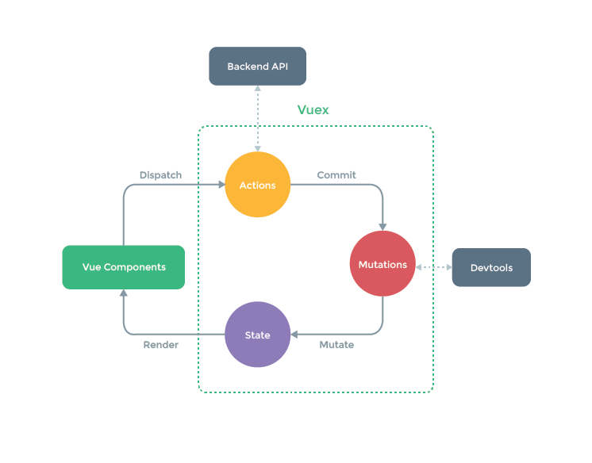

[TOC]

---
## 链接
[Vue官网https://cn.vuejs.org/](https://cn.vuejs.org/)

## 1.vue
### 1.1 结构
#### 1.1.1 选项/数据
    data
    props
    propsData
    compulted
    methods
    watch

#### 1.1.2 选项/DOM
    el
    template
    render
    renderError
    

## 2.vuex
    专为Vue.js应用程序开发的状态管理模式.

---    
- Mutations 
    操作State状态的唯一方法,只能是同步方法,通过commit提交mutations来改变state的状态.

- Actions
    为了处理异步方式而出现.可以间接使用Mutations, actions使用dispatch方法.

### 2.1 构造
    状态管理.state,actions,mutations,getters.修改state的状态不能直接修改要通过comit进行修改.
    import Vuex from 'vuex'
    const store = new Vuex.Store({
        state:{

        },
        mutations:{

        },
        actions:{

        },
        getters:{

        },
        modules:{
            
        }
    })
### 2.2 方法
    commit
    dispatch

## 3.Inno Setup打包
    使用bat脚本打包.*.ss文件.

## 4.ES6新特性
    a. let,const
    b. class,extend,super
    c. array function
    d. template string
    e. destructed
    f. default,rest